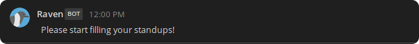
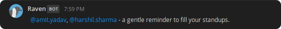
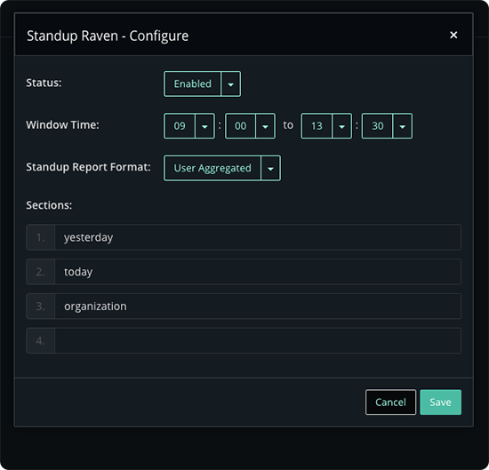
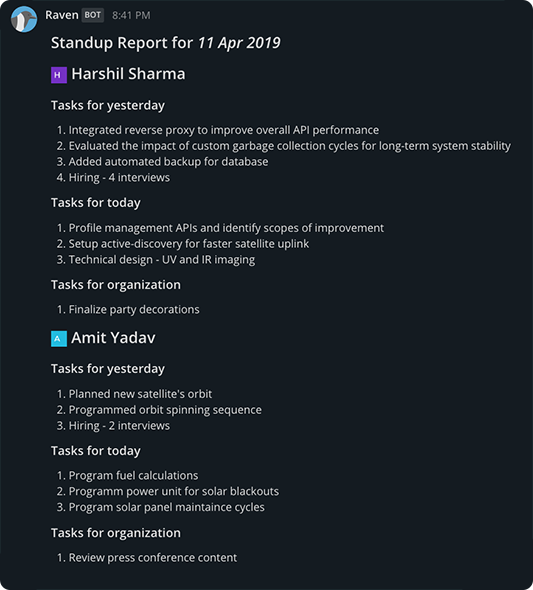
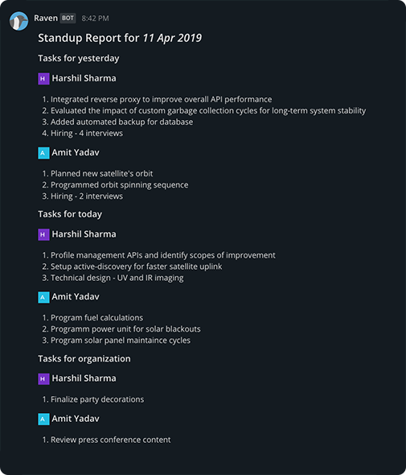

</img>
#

A Mattermost plugin for communicating daily standups across team

    </img>

## ✨ Features

* Configurable standup window per channel for standup reminders

* Automatic window open reminders

    
    
* Automatic window close reminders

    
    
* Per-channel customizable

    
    
* Automatic standup reports
    
    

* Multiple standup report formats -

  * User Aggregated - tasks aggregated by individual users

    
     
  * Type Aggregated - tasks aggregated by type

    

* Ability to preview standup report without publishing it in channel
* Ability to manually generate standup reports for any arbitrary date

## 🧰 Functionality

* Customize standup sections on per-channel basis, so team members can make it suite their style.

* Multiple report formats to choose from.

* Receive a window open notification at the configured window open time to remind filling your standup.

* Receive a reminder at completion of 80% of configured window duration to remind filling your standup. 
This message tags members who haven't yet filled their standup.

* Receive auto-generated standup report at the end of configured window close time. 
The generated standup contains names of members who have yet not filled their standup.

### TODO

* [ ] Permissions
* [ ] Vacation
* [ ] Periodic reports

## Index

* [🚦 Getting Started](docs/getting_started.md)
      
* [🏌️‍♀️Deployment](docs/deployment.md)

* [⚙ Plugin Configurations](docs/configuration.md)

* [⁉ Troubleshooting](docs/troubleshooting.md)

## 🌟 Attribution

Project logo (the Raven) is made by <a href="https://www.freepik.com/" title="Freepik">Freepik</a> from <a href="https://www.flaticon.com/" title="Flaticon">www.flaticon.com</a> is licensed by <a href="http://creativecommons.org/licenses/by/3.0/" title="Creative Commons BY 3.0" target="_blank">CC 3.0 BY</a>

