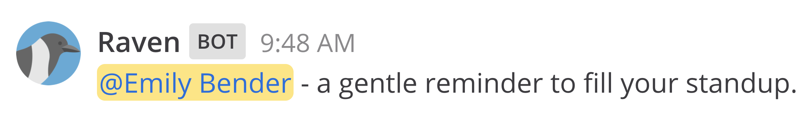
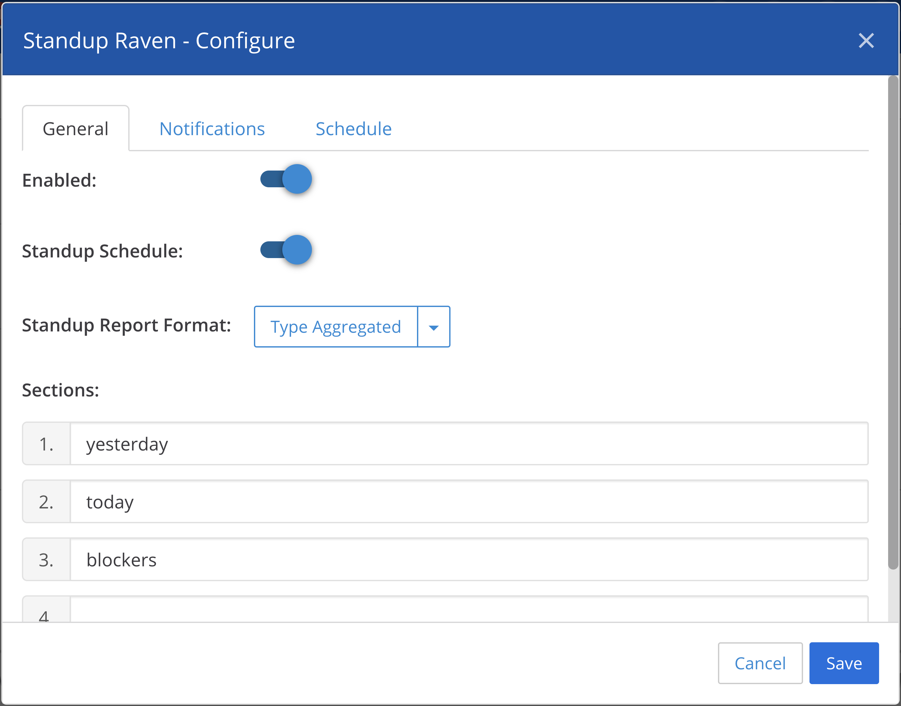
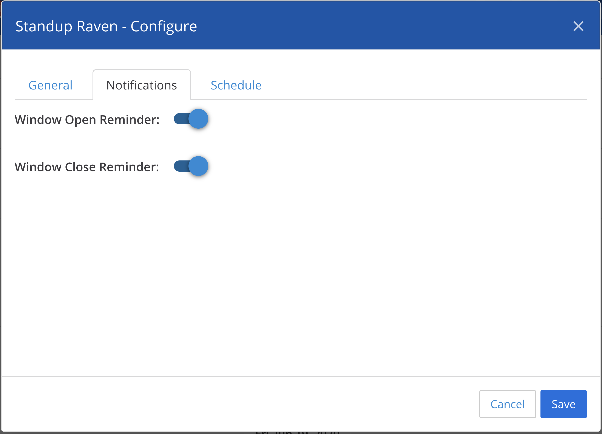
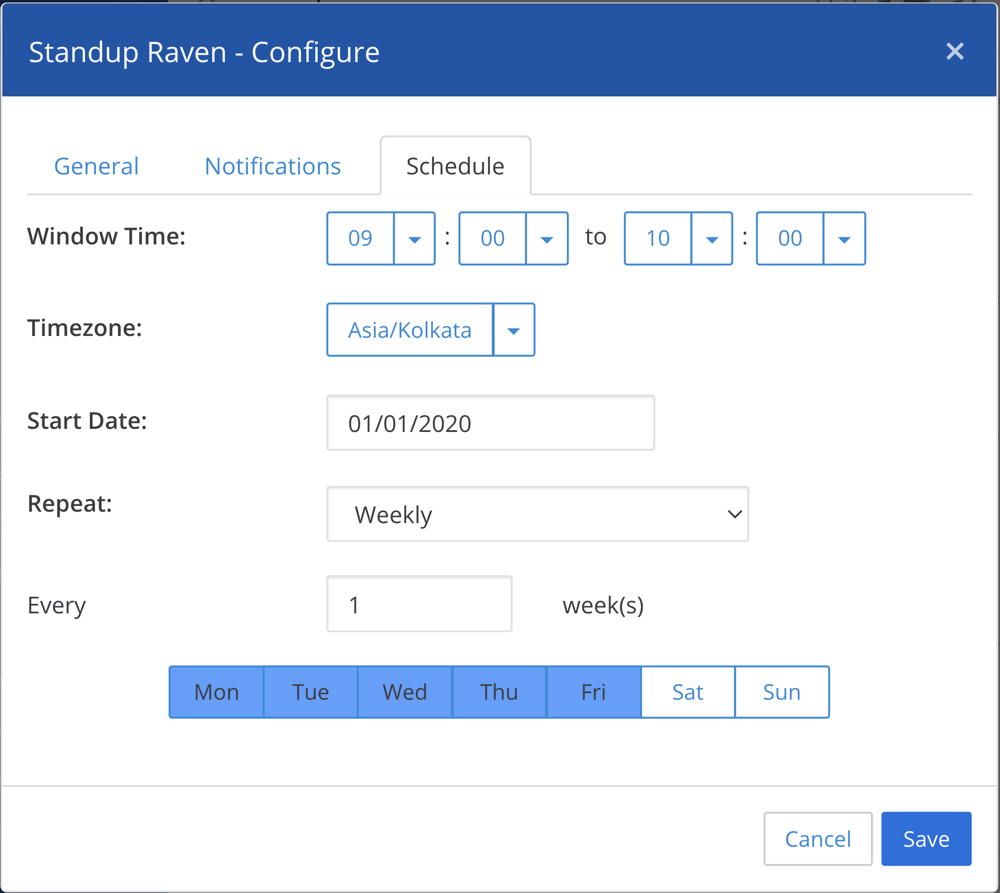
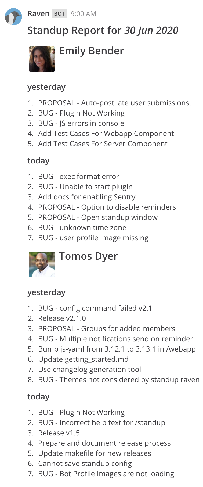

</img>
#

A Mattermost plugin for communicating daily standups across team

    </img>

## ✨ Features

* Configurable standup window per channel for standup reminders

* Automatic window open reminders

    
    
* Automatic window close reminders

    
    
* Per-channel customizable

    
    
    
    
    
    
* Automatic standup reports
    
    

* Multiple standup report formats -

  * User Aggregated - tasks aggregated by individual users

    
     
  * Type Aggregated - tasks aggregated by type

    

* Ability to preview standup report without publishing it in channel
* Ability to manually generate standup reports for any arbitrary date

## 🧰 Functionality

* Customize standup sections on per-channel basis, so team members can make it suite their style.

* Multiple report formats to choose from.

* Receive a window open notification at the configured window open time to remind filling your standup.

* Receive a reminder at completion of 80% of configured window duration to remind filling your standup. 
This message tags members who haven't yet filled their standup.

* Receive auto-generated standup report at the end of configured window close time. 
The generated standup contains names of members who have yet not filled their standup.

* Allow or restrict standup configuration modification to channel admins (Requires Mattermost EE).

## Guides

### User Guide

* 👩‍💼 [User Guide](docs/user_guide.md)

### Developer Guide

* 🚦 [Getting Started](docs/getting_started.md)

* 🐞 [Integrating Sentry](docs/sentry.md)

### Ops Guide

* ⬇ [Installing](docs/installation.md)

* 🏌️‍♀️[️Deployment](docs/deployment.md)

* ⚙ [Plugin Configurations](docs/configuration.md)

* ⁉ [Troubleshooting](docs/troubleshooting.md)

### TODO

* [x] Permissions
* [ ] Vacation
* [ ] Periodic reports

## Reporting Security Vulnerabilities

Due to the sensitive nature of such vulnerabilities, please refrain from posting them publically
over GitHub issues or any other medium.

Be responsible and report them to raven@joshtechnologygroup.com .

## 🌟 Attribution

Project logo (the Raven) is made by <a href="https://www.freepik.com/" title="Freepik">Freepik</a> from <a href="https://www.flaticon.com/" title="Flaticon">www.flaticon.com</a> is licensed by <a href="http://creativecommons.org/licenses/by/3.0/" title="Creative Commons BY 3.0" target="_blank">CC 3.0 BY</a>

## Contributors ✨

Thanks goes to these wonderful people ([emoji key](https://allcontributors.org/docs/en/emoji-key)):

<!-- ALL-CONTRIBUTORS-LIST:START - Do not remove or modify this section -->
<!-- prettier-ignore-start -->
<!-- markdownlint-disable -->
<table>
  <tr>
    <td align="center"><a href="https://github.com/jatinjtg"> <b>jatinjtg</b></a> <a href="https://github.com/Harshil Sharma/Standup Raven/commits?author=jatinjtg" title="Code">💻</a> <a href="https://github.com/Harshil Sharma/Standup Raven/issues?q=author%3Ajatinjtg" title="Bug reports">🐛</a> <a href="#ideas-jatinjtg" title="Ideas, Planning, & Feedback">🤔</a> <a href="https://github.com/Harshil Sharma/Standup Raven/commits?author=jatinjtg" title="Documentation">📖</a> <a href="#infra-jatinjtg" title="Infrastructure (Hosting, Build-Tools, etc)">🚇</a> <a href="https://github.com/Harshil Sharma/Standup Raven/commits?author=jatinjtg" title="Tests">⚠️</a></td>
    <td align="center"><a href="https://github.com/goku321"> <b>Deepak Sah</b></a> <a href="https://github.com/Harshil Sharma/Standup Raven/commits?author=goku321" title="Code">💻</a></td>
    <td align="center"><a href="http://sandipagarwal.in"> <b>Sandip Agarwal</b></a> <a href="https://github.com/Harshil Sharma/Standup Raven/commits?author=sandipagarwal" title="Code">💻</a></td>
    <td align="center"><a href="https://github.com/chetanyakan"> <b>Chetanya Kandhari</b></a> <a href="https://github.com/Harshil Sharma/Standup Raven/commits?author=chetanyakan" title="Code">💻</a> <a href="https://github.com/Harshil Sharma/Standup Raven/issues?q=author%3Achetanyakan" title="Bug reports">🐛</a> <a href="#ideas-chetanyakan" title="Ideas, Planning, & Feedback">🤔</a> <a href="https://github.com/Harshil Sharma/Standup Raven/commits?author=chetanyakan" title="Documentation">📖</a></td>
    <td align="center"><a href="https://github.com/ayadav"> <b>Amit Yadav</b></a> <a href="https://github.com/Harshil Sharma/Standup Raven/commits?author=ayadav" title="Code">💻</a></td>
    <td align="center"><a href="https://github.com/SezalAgrawal"> <b>SezalAgrawal</b></a> <a href="https://github.com/Harshil Sharma/Standup Raven/commits?author=SezalAgrawal" title="Code">💻</a></td>
    <td align="center"><a href="http://TheodoreLindsey.io"> <b>Theodore S Lindsey</b></a> <a href="https://github.com/Harshil Sharma/Standup Raven/commits?author=RagingRoosevelt" title="Code">💻</a></td>
  </tr>
  <tr>
    <td align="center"><a href="https://github.com/Amalkh5"> <b>Amal Alkhamees</b></a> <a href="https://github.com/Harshil Sharma/Standup Raven/commits?author=Amalkh5" title="Code">💻</a></td>
    <td align="center"><a href="https://github.com/henzai"> <b>henzai</b></a> <a href="https://github.com/Harshil Sharma/Standup Raven/issues?q=author%3Ahenzai" title="Bug reports">🐛</a></td>
    <td align="center"><a href="https://www.hardwario.com/"> <b>Pavel Hübner</b></a> <a href="#ideas-hubpav" title="Ideas, Planning, & Feedback">🤔</a> <a href="#userTesting-hubpav" title="User Testing">📓</a> <a href="#talk-hubpav" title="Talks">📢</a></td>
    <td align="center"><a href="https://github.com/tgly307"> <b>tgly307</b></a> <a href="#ideas-tgly307" title="Ideas, Planning, & Feedback">🤔</a> <a href="https://github.com/Harshil Sharma/Standup Raven/issues?q=author%3Atgly307" title="Bug reports">🐛</a></td>
    <td align="center"><a href="http://tzonkovs.wixsite.com/alex"> <b>Alex Tzonkov</b></a> <a href="#ideas-attzonko" title="Ideas, Planning, & Feedback">🤔</a> <a href="https://github.com/Harshil Sharma/Standup Raven/issues?q=author%3Aattzonko" title="Bug reports">🐛</a></td>
    <td align="center"><a href="https://github.com/sonam-singh"> <b>Sonam Singh</b></a> <a href="https://github.com/Harshil Sharma/Standup Raven/issues?q=author%3Asonam-singh" title="Bug reports">🐛</a> <a href="#ideas-sonam-singh" title="Ideas, Planning, & Feedback">🤔</a></td>
    <td align="center"><a href="https://github.com/skyscooby"> <b>Andrew Greenwood</b></a> <a href="#ideas-skyscooby" title="Ideas, Planning, & Feedback">🤔</a></td>
  </tr>
  <tr>
    <td align="center"><a href="https://github.com/mihai-satmarean"> <b>mihai-satmarean</b></a> <a href="#ideas-mihai-satmarean" title="Ideas, Planning, & Feedback">🤔</a></td>
  </tr>
</table>

<!-- markdownlint-enable -->
<!-- prettier-ignore-end -->
<!-- ALL-CONTRIBUTORS-LIST:END -->

This project follows the [all-contributors](https://github.com/all-contributors/all-contributors) specification. Contributions of any kind welcome!
