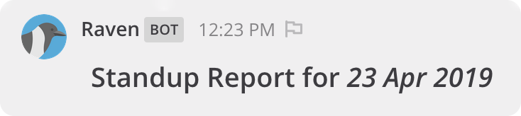

#

## ⬇ Installation

Upload the plugin binary for your platform in Mattermost `System Console` > `Plugins (BETA)` > `Management`.

## Mattermost Configuration

Standup Raven uses Mattermost integration's feature to display custom user name and profile picture
for a more engegaging experience.

While this is not required for working of the plugin, it's recommended for a more engaging experience.

Settings to enable in Mattermost -

1. `System Console` > `Integrations` > `Custom integrations` > `Enable integrations to override usernames` - set this to `true`. 
1. `System Console` > `Integrations` > `Custom integrations` > `Enable integrations to override profile picture icons` - set this to `true`.

Without allowing overrides - 

With allowing overrides -

